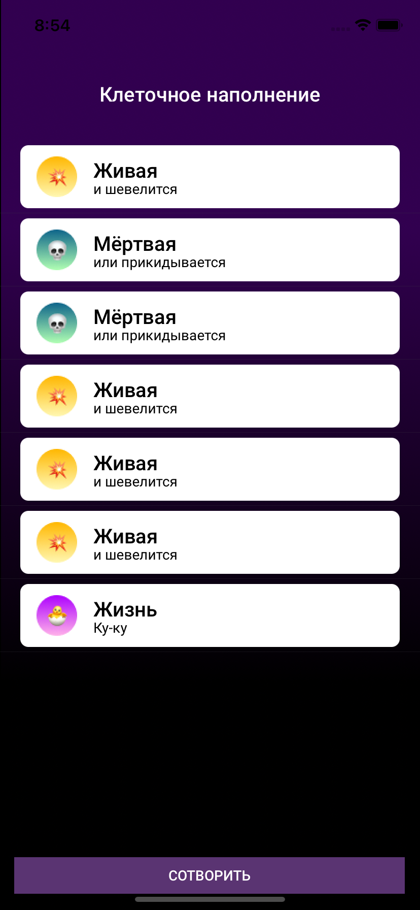

Решение тестового задания для собеседования.

## Описание приложения

Реализовать предоставленный дизайн и функционал приложения.

При нажатии кнопки "СОТВОРИТЬ" появляется новая ячейка.

Равновероятно может появиться ячейка либо "Живая", либо "Мёртвая".

Если подряд появляется три ячейки "Живая", то появляется ячейка "Жизнь".

Если подряд появляется три ячейки "Мёртвая", то ближайшая ячейка "Живая" становится "Мёртвая".

Изначально список ячеек пуст.

